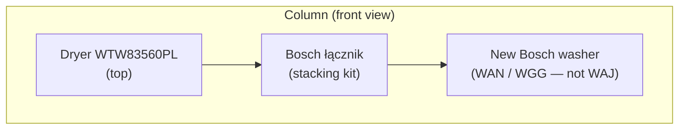

# Bosch washing machine research (Poland) — replacement for VarioPerfect Serie 8

> **Canvas-style export** — single reference for requirements, shortlist, comparison, and stacking with dryer **Bosch WTW83560PL**.  
> **Snapshot:** April 2026 · prices and stock change daily — verify before purchase.

---

## Your requirements (recap)

| Area | Requirement |
|------|-------------|
| Market | Poland (Ceneo, Media Expert, RTV Euro AGD, MediaMarkt, Neonet, etc.) |
| Budget | ~1 000–3 000 PLN (quality over absolute lowest price) |
| Smart / app | Not wanted; use only if unavoidable |
| Stacking | **Must** work in a column with existing **Bosch** dryer using a Bosch **łącznik** |
| Washing temp | At least **60 °C** (hygiene / cotton / programs) |
| Quick wash | ~**60 minutes** desired; see “Reality check” below |
| Dryer (yours) | **Bosch Serie 8** — **WTW83560PL** |

---

## Reality check: “~60 min at 60 °C”

Most current Bosch models advertise **Szybki 15′/30′** and **SpeedPerfect** (shorter main programs), not a single named program that is **both** full **60 °C** and **~60 minutes** in all marketing sheets.

- For **light soil**, use **15′/30′** (lower temps).
- For **60 °C hygiene / cotton**, expect **longer** cycles unless you combine **SpeedPerfect** + program choice — **confirm in the instruction PDF** for the exact model you buy.

---

## Stacking with your dryer: **WTW83560PL**

### Official Bosch Poland rules (summary)

- Stacking kits for **suszarka na pralce** are described as compatible with **all Bosch washing machines**, with one exception: models whose symbol starts with **`WAJ…`** (do not use those in this setup).
- **Choosing the kit** is driven mainly by the **dryer**; see the dryer’s accessories or spare-parts flow and the **E-number** on the nameplate (e.g. **WTW83560PL/03**).
- **Order:** only **dryer on top of washer** (never the reverse).
- Mounting a genuine Bosch kit **does not void warranty**; installation typically **requires drilling** the **washer** top for brackets — if you only replace the washer, the **łącznik** is re-fitted to the **new** machine per instructions.

**Reference:** [Bosch PL — przewodnik: łącznik montażu suszarka–pralka](https://www.bosch-home.pl/serwis/porady-i-wsparcie/przewodnik-dla-kupujacych-lacznik-montazu-suszarka-pralka)

### Your dryer’s dimensions (Bosch product data)

| Dimension | WTW83560PL (order H × W × D) |
|-----------|------------------------------|
| | **842 × 598 × 652 mm** |

- **Width 598 mm** — standard **60 cm** line; matches typical new Bosch front-loaders (~598 mm).
- **Depth 652 mm** — full-depth Serie 8 heat pump; a new washer is often **~59 cm** body depth. A small **front step** in depth is common; the **łącznik** still applies to the **60 cm** Bosch system. For **exact** kit and finish, use Bosch’s **compatibility** for **WTW83560PL** + your washer E-number.

**Product / support:** [Bosch PL — WTW83560PL](https://www.bosch-home.pl/pl/mkt-product/pranie-i-suszenie/suszarki/WTW83560PL) · [Support WTW83560PL](https://www.bosch-home.pl/support/list/WTW83560PL)

### Łącznik part families (typical in PL — confirm for your E-numbers)

Polish retail often lists kits such as **WTZ11400** (with pull-out shelf), **WTZ27400** / **WTZ27410** (variants without shelf or different finish). **Do not guess** — pick the part **Bosch lists for WTW83560PL** (or keep your current kit if it was factory-correct and reattach to the new washer).

**Category:** [Bosch PL — łączniki do montażu suszarki na pralce](https://www.bosch-home.pl/pl/category/pranie-i-suszenie/akcesoria-do-montazu-i-zabudowy/laczniki-do-montazu-suszarki-na-pralce)

---

## Shortlist: three Bosch candidates

All are **Bosch front-loaders**, **`WAN` / `WGG`** (not **`WAJ`**), **Home Connect: Nie** on official **Bosch PL** product cards for these SKUs at time of research — **no smartphone required** for normal use.

| Criterion | **WAN2825KPL** (Serie 4) | **WGG242ZGPL** (Serie 6) | **WGG244F8PL** (Serie 6, i-DOS) |
|-----------|-------------------------|--------------------------|----------------------------------|
| **Indicative price (PLN)** | ~**1 799** (e.g. RTV Euro AGD, Ceneo band) | ~**1 995–2 600** | ~**3 000** promo / ~**3 400** list (e.g. Media Expert) |
| **Load / max spin** | 8 kg / **1 400** rpm | 9 kg / **1 200** rpm | 9 kg / **1 400** rpm |
| **Depth (typical)** | ~**59 cm** | ~**58,8 cm** | ~**58,8 cm** |
| **60 °C+** | Yes (bawełna, higiena, temp. regulation) | Yes | Yes (Eco 40–60, Higiena Plus, etc.) |
| **Quick / shorten** | **15′/30′** + **SpeedPerfect** | **15′/30′** + **SpeedPerfect** | Super krótki, Mix szybki, etc. + **SpeedPerfect** |
| **i-DOS** | No | No | **Yes** (dosing on panel; can be ignored) |
| **Smart / app** | **Nie** (Bosch PL) | **Nie** (Bosch PL) | **Nie** Home Connect (Bosch PL) |
| **Stacking with WTW83560PL** | Yes — same Bosch 60 cm system; łącznik per **dryer**; **not WAJ** | Same | Same (often bundled with e.g. WTZ27400-class kits in shops) |
| **Positioning** | **Best value**, 1 400 rpm, minimal extras | **Serie 6** without i-DOS; **1 200 rpm** vs top Serie 6 | **Best overall in range** if ~3 k PLN OK; i-DOS + 9 kg + 1 400 rpm |

### “A bit more expensive but worth it”

- **WGG244F8PL** on **~3 000 PLN** promotion: strongest match to **quality + features** in the budget; **i-DOS** is optional; still **not** app-dependent per Bosch PL card.

### Models to treat as secondary / legacy

- **WAN2407KPL** / **WAN2407EPL** — older Serie 4 wave; may be **EOL** or “last pieces”. Prefer **WAN2825KPL** for current spec clarity.
- **Old VarioPerfect** (e.g. WAB…) — replaced by current **SpeedPerfect** / program naming; not a 1:1 panel match.

---

## Per-model notes (from web research)

### Bosch WAN2825KPL

- **~1 799 PLN** in sample listings; always check Ceneo on the day.
- **EcoSilence Drive**; **10-year motor** promotion (terms on Bosch PL).
- **15′/30′** quick; **no** dedicated “~60 min” in short spec lists — use **SpeedPerfect** + program.
- [Spec PDF (Bosch)](https://media3.bosch-home.com/Documents/specsheet/pl-PL/WAN2825KPL.pdf) · [Bosch product](https://www.bosch-home.pl/pl/mkt-product/WAN2825KPL) · [Ceneo](https://www.ceneo.pl/189424648) · [RTV Euro AGD example](https://www.euro.com.pl/pralki/bosch-wan2825kpl-8kg-1400obr-min.bhtml)

### Bosch WGG242ZGPL

- Mid-2k PLN band; **no i-DOS**; **1 200 rpm** (vs 1 400 on WAN2825KPL and WGG244F8PL).
- Good “sweet spot” if you want **Serie 6** without automatic dosing.
- [Ceneo](https://www.ceneo.pl/164261111) · [Bosch product](https://www.bosch-home.pl/pl/mkt-product/pranie-i-suszenie/pralki/pralki-ladowane-od-frontu/WGG242ZGPL)

### Bosch WGG244F8PL

- **~3 000 PLN** with codes / promos; list price often higher.
- **i-DOS** — clean drawer periodically per reviews.
- [Bosch product](https://www.bosch-home.pl/pl/mkt-product/pranie-i-suszenie/pralki/pralki-ladowane-od-frontu/WGG244F8PL) · [Media Expert example](https://www.mediaexpert.pl/agd/pralki-i-suszarki/pralki/pralka-bosch-wgg244f8pl-9kg-1400-obr) · [Ceneo](https://www.ceneo.pl/165766880)

---

## Longevity and reviews (honest summary)

- **No** independent public data proves “Serie 6 lasts X years longer than Serie 4.”
- **EcoSilence Drive** and **10-year motor** promo are consistent talking points across models.
- Shop ratings are often high; **filter** reviews that are clearly **promo/incentivized**; check **Ceneo** and **elektroda**-style threads for long-term issues (bearings, service) — **anecdotal**, not statistics.

---

## Before you buy (checklist)

1. [ ] **Ceneo** (or two shops) for **lowest trusted** price and warranty terms.  
2. [ ] On the product page, re-check **Home Connect: Nie** (or your acceptable level).  
3. [ ] Download the **instruction PDF** / specsheet for the **exact** model suffix (**…KPL**).  
4. [ ] **Łącznik:** confirm part for **WTW83560PL** (E-nr) + new washer; re-drill on new washer if replacing machine only.  
5. [ ] **Avoid** washer models **`WAJ…`** for Bosch-documented stacking with your setup.

---

## Source index

| Source | URL |
|--------|-----|
| Bosch PL — łącznik guide | <https://www.bosch-home.pl/serwis/porady-i-wsparcie/przewodnik-dla-kupujacych-lacznik-montazu-suszarka-pralka> |
| Bosch PL — łączniki (category) | <https://www.bosch-home.pl/pl/category/pranie-i-suszenie/akcesoria-do-montazu-i-zabudowy/laczniki-do-montazu-suszarki-na-pralce> |
| Bosch — WTW83560PL | <https://www.bosch-home.pl/pl/mkt-product/pranie-i-suszenie/suszarki/WTW83560PL> |
| Bosch — WAN2825KPL | <https://www.bosch-home.pl/pl/mkt-product/WAN2825KPL> |
| Bosch — WGG244F8PL | <https://www.bosch-home.pl/pl/mkt-product/pranie-i-suszenie/pralki/pralki-ladowane-od-frontu/WGG244F8PL> |
| Bosch — WGG242ZGPL | <https://www.bosch-home.pl/pl/mkt-product/pranie-i-suszenie/pralki/pralki-ladowane-od-frontu/WGG242ZGPL> |
| PDF WAN2825KPL | <https://media3.bosch-home.com/Documents/specsheet/pl-PL/WAN2825KPL.pdf> |
| Ceneo — WAN2825KPL | <https://www.ceneo.pl/189424648> |
| Ceneo — WGG242ZGPL | <https://www.ceneo.pl/164261111> |
| Ceneo — WGG244F8PL | <https://www.ceneo.pl/165766880> |

---

## Caveats

- **Prices and promotions** in PL shops change frequently; table figures are **indicative**.  
- **Stacking kit** part numbers vary by **dryer E-number** and kit type (shelf vs no shelf); always use **Bosch** confirmation or qualified installer.  
- **Mermaid** diagram above may not render in all viewers; it is optional.

---

*Document generated for personal purchase planning. Not affiliated with Bosch or retailers.*
